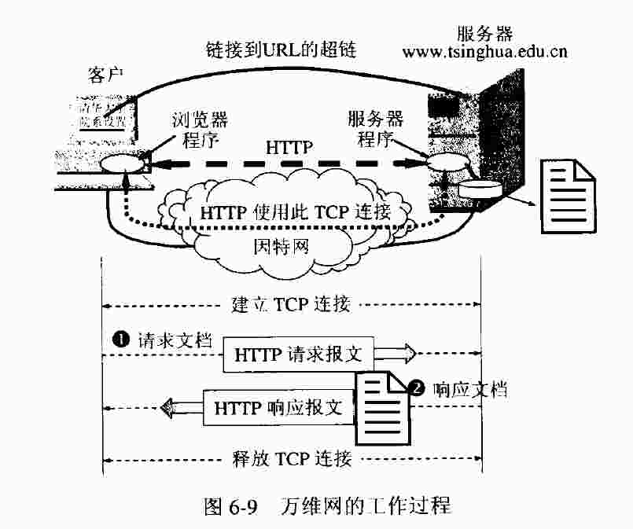
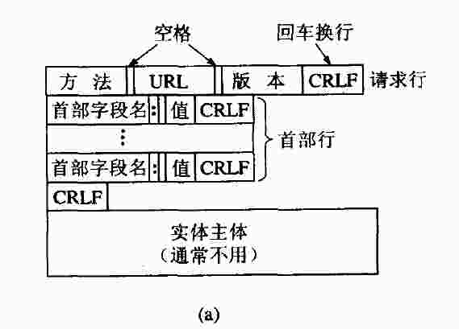
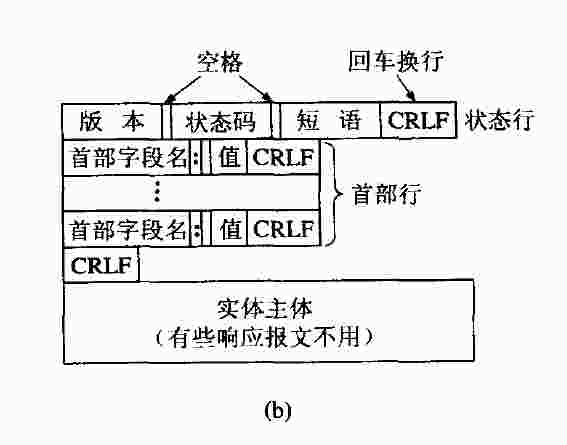
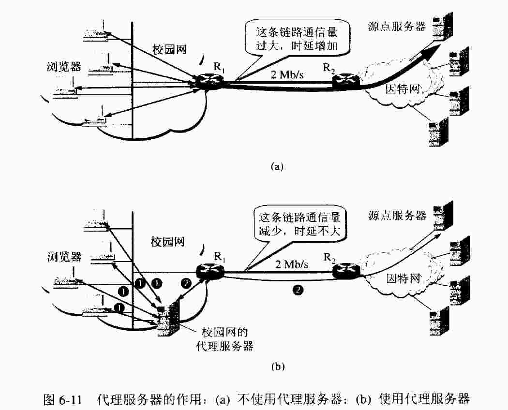

## Http Procotol

关于 http 协议，网上已经有蛮多大而全面的资料，我自己找的几个如下：

- [HTTP: The Protocol Every Web Developer Must Know Part 1](https://code.tutsplus.com/tutorials/http-the-protocol-every-web-developer-must-know-part-1--net-31177)

- [	
HTTP: The Protocol Every Web Developer Must Know - Part 2](https://code.tutsplus.com/tutorials/http-the-protocol-every-web-developer-must-know-part-2--net-31155)

其实网上的内容已经说的听清楚了，最近观看了 mooc 上 [哈工大-计算机网络](https://www.icourse163.org/learn/HIT-154005?tid=1002644012#/learn/announce) 的视频课程,结合书籍 [谢希仁-计算机网络](http://vdisk.weibo.com/s/uplMTlCGZiU2s)，针对 http 这一部分做一个小小的总结。

提纲：

- http 工作流程
- http 请求
- http 响应
- http 特性
- 代理服务器

### Http 工作流程

#### 总览

这里用一个实例来说明整个过程：

当你在浏览器中键入一个 url, 然后回车，这其中发生了什么？

比如，访问 https://leetcode.com/problems/palindrome-partitioning-ii/description/

1. 浏览器分析链接指向页面的 url
2. 浏览器像 DNS 请求解析 https://leetcode.com 的 IP 地址
3. 域名系统 DNS 解析出 leetcode 的 IP 地址为 104.27.161.90
4. 浏览器与 leetcode 服务器建立 TCP 链接
5. 浏览器发出取文件的命令： GET /problems/palindrome-partitioning-ii/description/
6. 服务器向 https://leetcode.com 给出响应，把文件发送给浏览器
7. 释放 TCP 链接
8. 浏览器显示 leetcode 服务器发回的文本

### Http 请求

请求的报文格式

其中各个字段的含义，网上已经写烂了，就不多说了。列一下字段就行了

- 方法
- URL
- 请求携带的字段
- 实体主体

讲一讲 GET 和 POST 的区别：携带的请求信息所放的位置不同，GET 是把信息放在 URL 中，而 POST 是把信息放在 实体主体中。

### Http 响应

响应的报文格式

同样给出一些重要的字段：

- 状态码
- 响应携带的字段
- 实体主体

### http 特性

最重要的需要掌握的就是　**无状态**

每次请求都是独立的，服务端不会针对客服端做任何识别处理。所以需要 Cookie 技术在服务器上存放用户的信息，达到记录的作用。

### 代理服务器

代理服务器，也称万维网高速缓存技术。

人家比我说的明白，查看 [What is Proxy Caching?](https://www.maxcdn.com/one/visual-glossary/proxy-caching/)

